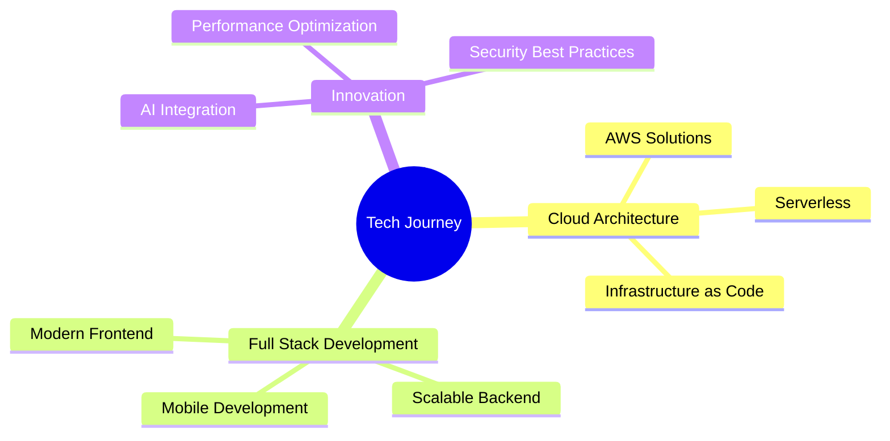

# < Hello World! I'm Aleks /> 👋

<div align="center">
  
  [](https://git.io/typing-svg)
  
</div>

<div align="left">
  
  ```javascript
  const aleks = {
    code: ["JavaScript", "TypeScript", "Java", "C#"],
    architecture: ["microservices", "event-driven", "serverless"],
    currentFocus: "Building scalable cloud-native applications",
    challenge: "Pushing the boundaries of modern web technologies"
  };
  ```

</div>

## 🚀 Tech Universe

<div align="center">

### Core Technologies
 
 


### Frontend Mastery


### Backend & Infrastructure


### Cloud Platforms


</div>

## 💡 Innovation Hub

<div align="center">
  <table>
    <tr>
      <td align="center" width="50%">
        
      </td>
      <td align="center" width="50%">
        
      </td>
    </tr>
  </table>
</div>

## 🎯 Current Focus



## 🌐 Let's Connect

<div align="center">
  <a href="https://linkedin.com/in/aleksmanov" target="_blank">
    
  </a>
  <a href="mailto:contact@aleksmanov.me">
    
  </a>
</div>

---

<div align="center">
  
  [](https://git.io/typing-svg)

</div>
